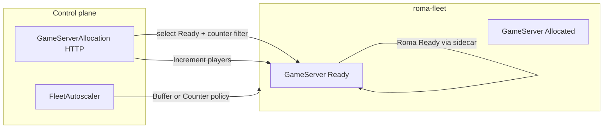

# Agones scale-out: Buffer, Counter, and Roma Allocate

Pre-production skeleton aligned with **Agones 1.54.0** (CountsAndLists Beta). Complements [agones-room-lifecycle.md](./agones-room-lifecycle.md), which covers **Allocate → Ready → Shutdown** inside each GameServer pod.

## Mental model



| Layer | What scales | Manifest |
|-------|-------------|----------|
| **Buffer** | Count of spare **Ready** GameServers | `deploy/agones/buffer-autoscaler.yaml` |
| **Counter (`players`)** | Aggregate free player slots across the Fleet | `deploy/agones/fleetautoscaler-counter.yaml` + `fleet.yaml` `counters.players` |
| **Allocate** | Picks a GameServer and optionally increments `players` | `deploy/agones/gameserverallocation-players.yaml` |

Apply **either** the Buffer autoscaler **or** the Counter autoscaler on `roma-fleet`, not both.

## Configure Buffer autoscaler

Edit `deploy/agones/buffer-autoscaler.yaml`:

| Field | Role |
|-------|------|
| `policy.buffer.bufferSize` | Target number of **Ready** GameServers not yet allocated |
| `policy.buffer.minReplicas` / `maxReplicas` | Fleet size floor/ceiling |
| `sync.fixedInterval.seconds` | Reconcile period (30s default) |

`bufferSize` accepts an integer or percentage string (Agones `IntOrString`), e.g. `5` or `"10%"`.

**Roma connection:** When Roma marks a server **Ready** (`ROMA_AGONES_BACKEND=sidecar`, `POST /ready`), it enters the buffer pool. `pkg/agones` HTTP allocate (`ROMA_AGONES_ALLOCATOR=http`) moves a server to **Allocated** via the allocation API, consuming one unit of buffer until the autoscaler adds another Ready instance.

**Load predict hook:** `pkg/loadpredict.PreScaleSignal.TargetBuffer` is a planning hint for operators or automation to raise `bufferSize` / `maxReplicas` ahead of spikes (7–15 minute lead window in code comments).

## Configure player counter

1. **Declare** on the Fleet template (`deploy/agones/fleet.yaml`):

   - Key: `players`
   - `count`: current players on that GameServer
   - `capacity`: max players per room instance (64 in skeleton)

2. **Scale** (optional path): `deploy/agones/fleetautoscaler-counter.yaml` sets `policy.type: Counter` with `key: players`, `bufferSize` (free slots to keep), `minCapacity`, `maxCapacity`.

3. **Runtime updates:** In production, use the [Agones SDK Beta counter APIs](https://agones.dev/site/docs/guides/counters-and-lists/) (`IncrementCounter` / `DecrementCounter`) from Roma when sessions connect/disconnect. CI does not require a cluster; manifests are validated structurally via `make validate-agones-manifests`.

See `deploy/agones/counter.yaml` for a short index of counter-related files.

## Roma Allocate hookup

Environment variables (full table in [agones-room-lifecycle.md](./agones-room-lifecycle.md)):

| Variable | Scale-out relevance |
|----------|---------------------|
| `ROMA_AGONES_FLEET` | Must match `metadata.name` in `fleet.yaml` (`roma-fleet`) |
| `ROMA_AGONES_ALLOCATION_URL` | POST target for GameServerAllocation |
| `ROMA_AGONES_ALLOCATOR` | `http` on cluster; `mock` in CI |
| `ROMA_AGONES_ALLOCATION_PLAYERS_COUNTER` | `0` (default) legacy selectors only; `1` / `true` counter-aware body |
| `ROMA_AGONES_ALLOCATION_PLAYERS_MIN_AVAILABLE` | `1` — `selectors[].counters.players.minAvailable` |
| `ROMA_AGONES_ALLOCATION_PLAYERS_INCREMENT` | `1` — top-level `counters.players.amount` on successful allocate |

**Go allocator** (`pkg/agones/http_allocator.go`):

- **Default (CI / legacy):** `gameServerSelectors` with `agones.dev/fleet: <ROMA_AGONES_FLEET>` only.
- **Counter mode** (`ROMA_AGONES_ALLOCATION_PLAYERS_COUNTER=1`): JSON matches `gameserverallocation-players.yaml` — `scheduling: Packed`, `priorities` on `players`, Ready + Allocated `selectors` with `minAvailable`, and `counters.players` `Increment`.

Pre-prod cluster Roma:

```bash
export ROMA_AGONES_ALLOCATOR=http
export ROMA_AGONES_ALLOCATION_URL=https://<allocator>/gameserverallocation
export ROMA_AGONES_ALLOCATION_PLAYERS_COUNTER=1
```

**Mock / local path** (no counter on cluster):

```bash
make agones-room-demo
curl -s -X POST http://127.0.0.1:18092/v1/agones/allocate \
  -H 'Content-Type: application/json' \
  -d '{"zone_id":"dev","shard":0}'
```

## Verification

```bash
make validate-agones-manifests
make test-agones-room
make check-agones
make test    # full repo; must stay green
```

On a dev cluster with Agones 1.54+:

```bash
kubectl apply -f deploy/agones/fleet.yaml -f deploy/agones/buffer-autoscaler.yaml
kubectl get fleet roma-fleet
kubectl get fleetautoscaler roma-buffer-autoscaler
kubectl describe gameserver -l agones.dev/fleet=roma-fleet | grep -A5 Counters
```

## References

- [Agones Counters and Lists](https://agones.dev/site/docs/guides/counters-and-lists/)
- [Fleet Autoscaler reference](https://agones.dev/site/docs/reference/fleetautoscaler/)
- [Agones 1.54.0 release](https://github.com/googleforgames/agones/releases/tag/v1.54.0)
